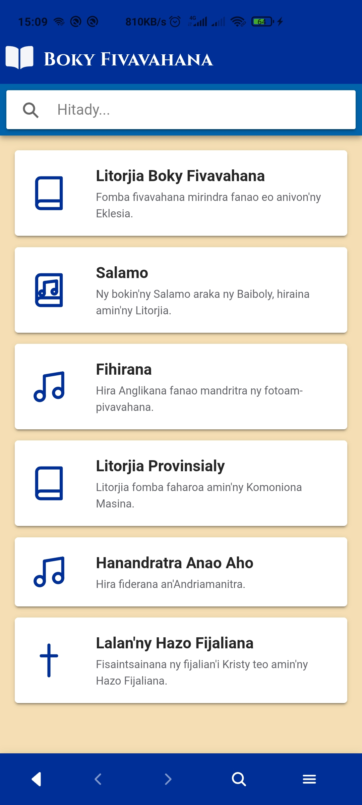
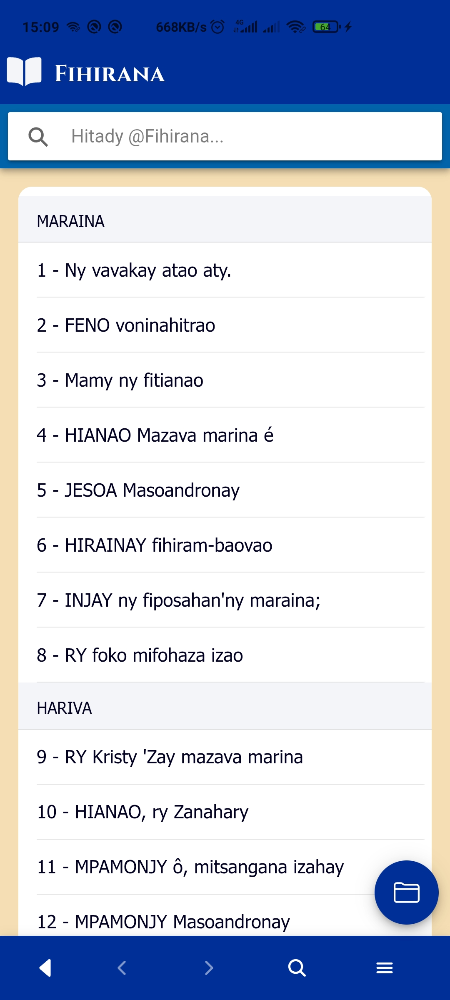
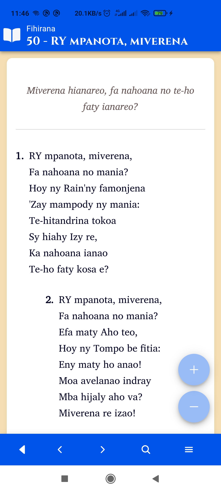

# Boky Fivavahana (Ionic Vue)

**Boky Fivavahana Anglikana** — A modern Anglican Common Prayer Book app in Malagasy.

> _"Voninahitra ho an'Andriamanitra irery ihany."_

---

## 📖 Overview

**Boky Fivavahana Anglikana** is a free, offline-first mobile application providing the full liturgical and musical heritage of the Anglican Church in Madagascar.

The app is written in **Ionic Vue**, offering a native-feeling experience with smooth transitions and high-performance search across thousands of entries.

### 📚 Content Included

- **Litorjia Boky Fivavahana** — Main Anglican Liturgies
- **Salamo** — The Book of Psalms
- **Fihirana** — Standard Hymnal
- **Litorjia Provinsialy** — Provincial Liturgy
- **Hanandratra Anao Aho (H.A.A)** — Praise & Worship Hymns
- **Lalan'ny Hazo Fijaliana** — Stations of the Cross

---

## ✨ Features

- **🚀 High Performance:** Powered by Vue 3 and Pinia with optimizations for near-instant rendering of large datasets.
- **🔍 Global & Scoped Search:** Search the entire library at once or filter results within a specific book (e.g., just within H.A.A).
- **🌙 Native Feel:** Follows Android/iOS design patterns with smooth animations and adaptive headers.
- **📱 One-Handed Navigation:** Bottom-focused UI and easy-access side menu for quick book switching.
- **📶 100% Offline:** All data is bundled locally. Zero data usage after installation.

---

## 🛠 Tech Stack

- **Framework:** [Ionic Vue](https://ionicframework.com/docs/vue/overview) (Vue 3)
- **State Management:** [Pinia](https://pinia.vuejs.org/) (with shallow reactivity for performance)
- **Native Bridge:** [Capacitor 8](https://capacitorjs.com/)
- **Icons:** [Ionicons](https://ionicons.com/)
- **Styling:** CSS Variables (supporting system-wide theming)

---

## 📲 Installation

1.  Download the latest `boky-fivavahana2.apk` from the [Releases](https://github.com/ulightm111/boky-fivavahana-ion/releases/latest) page.
2.  Ensure "Install from unknown sources" is enabled in your Android settings.
3.  Open the APK to install.
    - _Compatible with Android 7.0 (Nougat) up to Android 16._

---

## 🏗 Build Instructions

If you wish to contribute or build the app from source:

### Prerequisites

- **Node.js:** 20+ (LTS recommended)
- **Android Studio:** Latest version with SDK 34+
- **Java:** JDK 17+

### Steps

```bash
# 1. Clone the repository
git clone https://github.com/ulightm111/boky-fivavahana-ion.git
cd boky-fivavahana-ion

# 2. Install dependencies
npm install

# 3. Build the Vue production assets
npm run build

# 4. Sync the web assets to the Android platform
npx cap sync android

# 5. Build and Run on a device/emulator
npx cap run android
```

---

## 📸 Screenshots

| Books View                                       | Song List                                        | Content View                                     |
| :----------------------------------------------- | :----------------------------------------------- | :----------------------------------------------- |
|  |  |  |

---

## 📜 License & Credits

- **License:** Released under the [GNU General Public License v3.0](https://www.google.com/search?q=LICENSE).
- **Credits:** _FEEM NTIC — Lead Code Group_.
- **Maintainer:** Tsiory M.

---

## 🤝 Feedback

Mandraisa anjara\! If you find a typo in the liturgies or a bug in the code:

- **GitHub:** Open an issue in this repository.
- **Email:** tsiorymanana7@gmail.com
- **Phone:** +261 34 70 485 04
